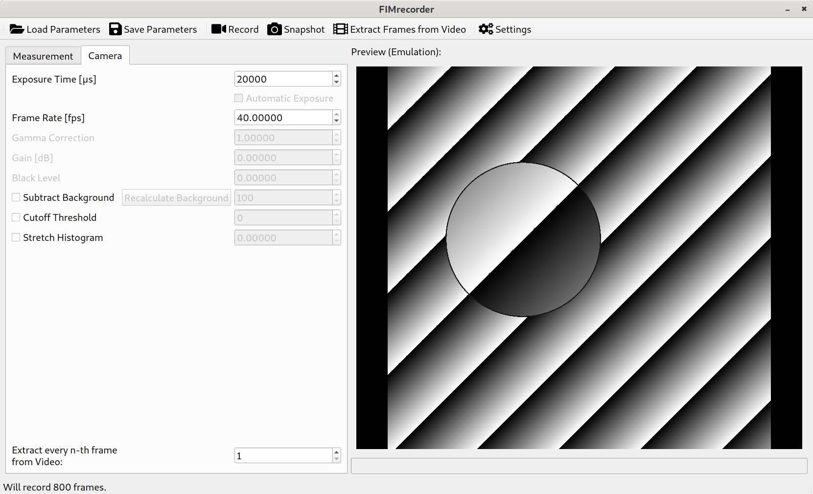

# FIMrecorder {-}

# Resources
[FIM](https://www.uni-muenster.de/PRIA/en/FIM/index.html)
[FIMTrack](https://www.uni-muenster.de/PRIA/en/FIM/download.shtml)
[FIMTrack source code](https://github.com/i-git/FIMTrack)
[FIMrecorder source code](https://github.com/fncnt/fimrecorder)

# Installation
See [`README.md`](https://github.com/fncnt/fimrecorder/blob/master/README.md) in the repository. 

# Usage
Basic workflow

## Supported Devices

## Overview

## Configuration
To adjust settings not visible in the UI, click the button labelled *Settings*. This will launch your favourite text editor allowing you to edit the main configuration.

### `settings.json`
`settings.json` is the primary configuration file and can be edited using any text editor. It contains data (`"Parameters"`) relevant to  your measurement (see [Measurement Annotations](#measurement-annotations) for a detailed description).
More importantly, it contains a `"Settings"` section controlling the behaviour of the application.
The following options can be modified:

`Background Frames to average`:
 ~  Number of Frames that should be used to construct an averaged static background image for background subtraction.
 ~  `default: 100`

`Configuration Directory`:
 ~  Path of the directory where additional configurations files should be stored.
 ~  `settings.json` is **not** stored here.
 ~  `default: "config"`
 
`Default Camera Parameters`:
 ~  `default: "FIM_NodeMap.pfs"`

`Extract every n-th Frame`:
 ~  `default: 1`

`Logging Configuration`:
 ~  `default: "loggingconf.json"`

`Single Image Format`:
 ~  `supported: ".tif"`, `".tiff"`, `".png"`
 ~  `default: ".tif"`

`Snapshot Directory`:
 ~  `default: "snapshots"`

`Video Codec`:
 ~  `default: "XVID"`

`Video Container Format`:
 ~  `default: ".avi"`

*FIMrecorder* will fall back to hard-coded defaults and create a new configuration file if you happen to delete it.

### `.pfs` Files

In addition to `settings.json` there are `.pfs` files in your `Configuration Directory` for every camera model you've used in *FIMrecorder*. Those text files are being generated when you use a device for the first time with *FIMrecorder* and include all the parameters of the specific model.

Those files can be used to modify the resolution, offset and binning parameters of your device.
If in doubt, take a look at your `Default Camera Parameters` for a comparison.
It is recommended to not change other parameters other than those in these files unless you've read the documentation for your camera model provided by Basler.

## Recording Workflow

### Pre-Recording

#### Checking Setup
1. Adjusting field of view.
2. Adjust aperture.
3. Adjust focus. Use the magnifying feature by scrolling on the preview for more control.

#### Measurement Annotations

#### Applying Camera parameters

#### Real-Time Signal Modifications

### Post-Recording

#### Locating Recorded Data

#### Extracting Frames from Video Files

# Troubleshooting
Feel free to open an issue on [github](https://github.com/fncnt/fimrecorder/issues/new).

## Logging

### `loggingconf.json`
[See `logging.config`](https://docs.python.org/3.6/howto/logging-cookbook.html#an-example-dictionary-based-configuration)
